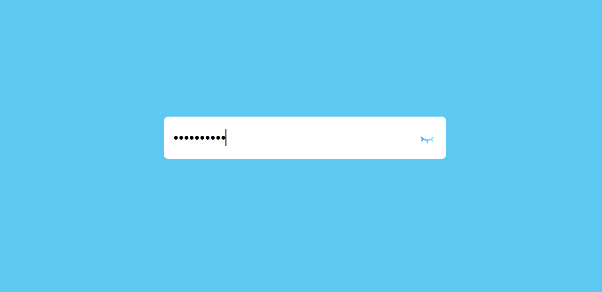
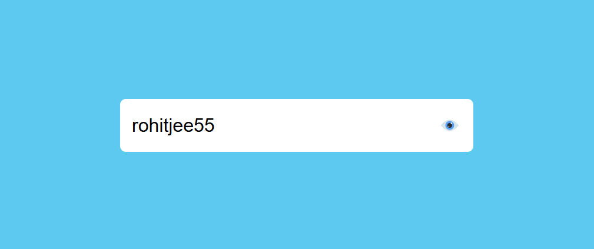

# Password Toggle

Simple password visibility toggle using JavaScript.

## Demo

## How to Use

1. Enter password in the input field
2. Click the eye icon to show/hide password
3. Icon changes between hide.png and open.png
4. Password switches between dots and plain text

## Tech Stack
- HTML, CSS, JavaScript
- Eye toggle icons (hide.png, open.png)

## Installation

Run it: Open index.html in browser
