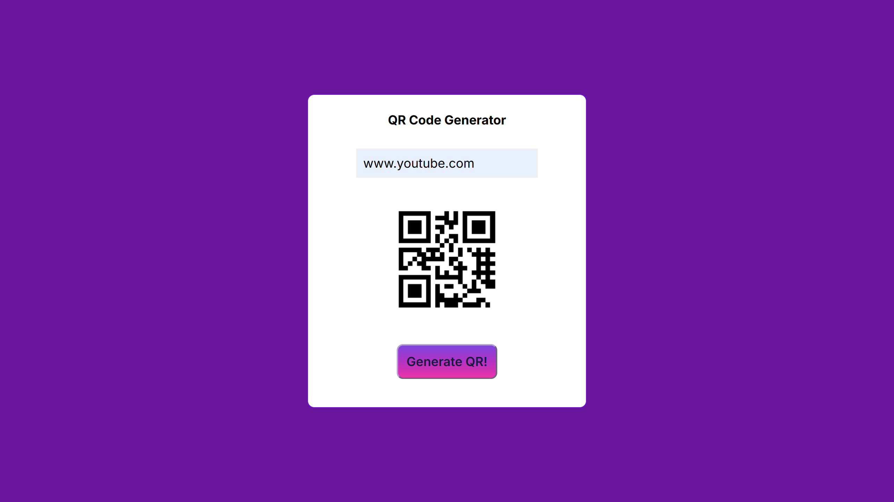

# QR Code Generator

Simple QR code generator using JavaScript.

## Demo

## How to Use

1. Enter text or URL
2. Click "Generate QR Code" button
3. Your QR code will appear below

## Tech Stack
- HTML, CSS, JavaScript
- QR Server API

## Installation

Run it: Open index.html in browser.
